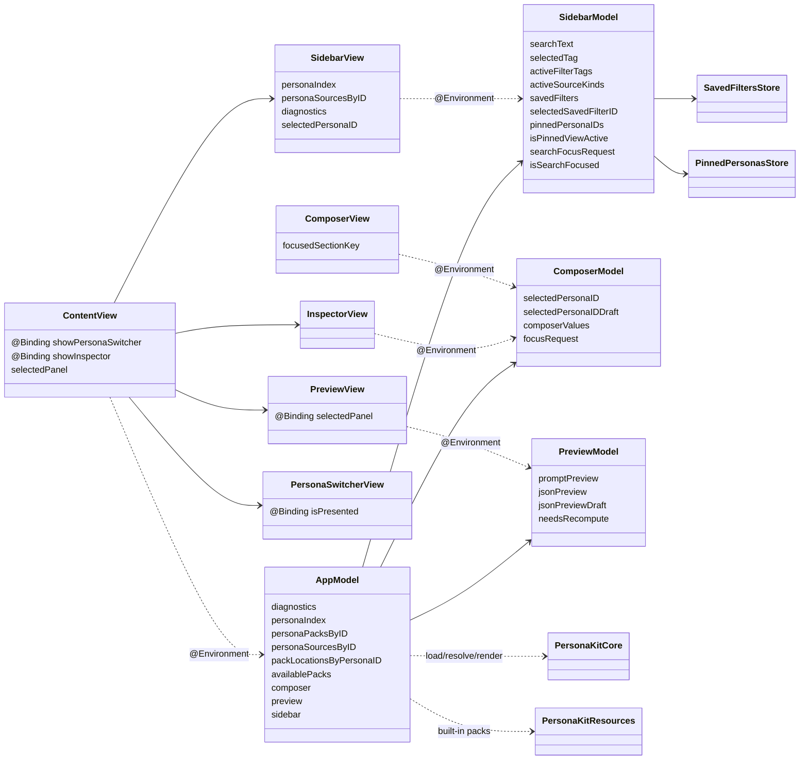

# Architecture System Design — PersonaKit App

This document describes the high-level structure of the PersonaKit macOS app,
the role of each component, and how data flows through the system. It is a
companion to `Docs/ArchitectureDefaults.md`.

## Scope
- App architecture only (not CLI or core library internals).
- Deterministic, file-based, offline behavior.
- Focused on component boundaries and data flow.

## Component Roles

### UI Shell
- `ContentView`: root shell. Owns window UI state (sidebar/detail, overlays).
- `SidebarView`: persona selection, search, pack visibility, diagnostics.
- `ComposerView`: edits prompt section values (context/evidence/task).
- `PreviewView`: displays composed prompt and JSON output.
- `InspectorView`: contextual details for the selected persona.
- `PersonaSwitcherView`: modal selection UI.

### Feature Models (UI-facing state)
- `SidebarModel`: search text, saved filters, pins, and sidebar state.
- `ComposerModel`: selected persona id, prompt values, focus requests.
- `PreviewModel`: prompt preview and JSON preview output.

### App Orchestrator
- `AppModel`: single orchestrator for cross-feature flow and IO.
  - Loads packs, builds indexes, and computes previews.
  - Owns app-level dependencies (file, clock, uuid, app).
  - Wires feature-model callbacks for recompute and JSON edits.

### Core Services
- `PersonaKitCore`: schema, resolver, renderer, and pack tooling.
- `PersonaKitResources`: built-in packs and bundled assets.

### Stores (file-backed)
- `SavedFiltersStore`: deterministic persistence of saved filters.
- `PinnedPersonasStore`: deterministic persistence of pinned personas.

## System Diagram (UML-style)

## Data Flow (Key Paths)

### 1) Reload packs
1. `ContentView` triggers `AppModel.reloadAll()`.
2. `AppModel` loads built-in packs and user packs.
3. `AppModel` builds indexes and diagnostics.
4. `AppModel` restores selection and recomputes previews.

### 2) Persona selection
1. `SidebarView` updates `ComposerModel.selectedPersonaIDDraft`.
2. `ComposerModel` forwards via `onSelectedPersonaIDChange`.
3. `AppModel.selectPersona(id:)` updates selection and recomputes preview.

### 3) Composer edits
1. `ComposerView` updates `composerValues` via keyed bindings.
2. `ComposerModel` triggers `onValuesChange`.
3. `AppModel` schedules and recomputes the preview.

### 4) JSON preview edits
1. `PreviewView` binds to `PreviewModel.jsonPreviewDraft`.
2. `PreviewModel` forwards edits via `onJSONChange`.
3. `AppModel.updatePreviewJSON` schedules formatting.

## Boundary Rules
- No runtime network access.
- All IO routed through `AppModel` dependencies.
- Feature models are UI state owners, not IO owners.
- Deterministic outputs: same inputs produce the same prompt/JSON.

## Notes on Ownership
- Feature models are the default binding surface for views.
- `AppModel` exists for orchestration, not as a global state dump.
- Keyed bindings (composer values) remain helper methods.
