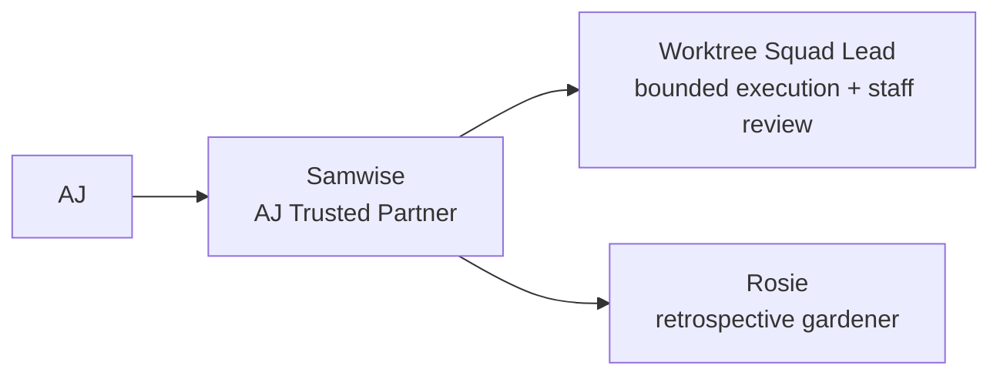
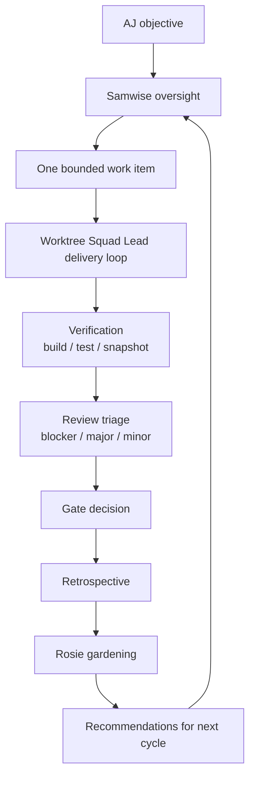
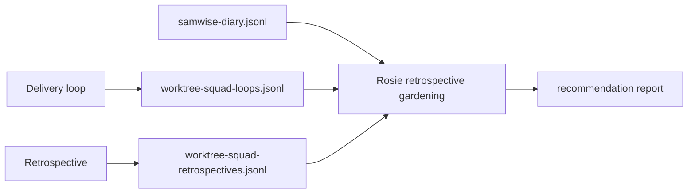

# Worktree Squad Cheat Sheet

Status: Active  
Owner: AJ + Samwise  
Last Reviewed: 2026-03-09

## Purpose

This is the fast mental model for how Samwise, AJ's Trusted Partner, Worktree
Squad Lead, and Rosie work together.

## Core Roles

1. `AJ`
   - approval authority
   - protected `main` owner
2. `Samwise`
   - AJ's Trusted Partner and orchestration lead
   - defines gates and stop points
   - decides whether work is ready to advance
3. `Worktree Squad Lead`
   - runs one bounded work loop inside an isolated worktree
   - performs staff-level code review before gate advancement
4. `Rosie`
   - reads diary and retrospective artifacts
   - proposes improvements for the next iteration

## Main Loop

## What Happens In A Delivery Loop

1. Samwise assigns one bounded work item.
2. Worktree Squad Lead confirms the approved lane contract, the materialized
   worktree scope, and the commit mode.
3. Worktree Squad Lead executes the work item.
4. Verification evidence is recorded.
5. Staff-level review findings are recorded.
6. Gate decision is made.
7. A loop log entry is appended.
8. If the assignment is done, a retrospective is required.

## Retrospective default

When a checkpoint is testing persona fidelity, process quality, or a
product-bearing milestone closeout, use:

1. `fan-out` first
   - preserve raw specialist passes without cross-contamination
2. `roundtable` second
   - clarify disagreements and sharpen the final language
3. one canonical `Starfish` synthesis at the end

Rules:

1. Planned roles do not count as active participants.
2. Retrospectives should record declared roles, actual participants, and
   participant evidence paths explicitly.
3. Feature, product, and process confidence should be recorded separately.
4. Do not describe a run as multiagent unless participant evidence supports it.
5. Use `roundtable` alone or `fan-out` alone only when the checkpoint is small
   enough that the hybrid flow would be unnecessary overhead.

## Evidence Trail

## Safety Rules

1. Primary repository `main` is protected and never changed without explicit AJ
   permission.
2. The manifest-approved branch contract is the durable lane identity.
3. Isolated worktrees are valid execution scopes for that lane.
4. Commit mode must always be explicit:
   - `per-commit-approval`
   - `worktree-auto-commit-approved`
5. One bounded work item per loop unless AJ expands scope.
6. Blockers unresolved by the next checkpoint must escalate to AJ.

## Named Multi-Worktree Mode

When AJ approves a bounded multi-worktree execution strategy, each approved
non-`main` worktree must have:

- a named milestone or scope boundary
- explicit commit mode
- explicit promotion rules back toward `main`

Rules:

1. `main` remains protected and manual-review only.
2. Standing commit authority applies only inside the explicitly approved
   non-`main` worktrees.
3. One worktree may be designated the official milestone branch.
4. A second worktree may be designated exploratory, but it does not silently
   redefine the milestone branch.
5. Scope changes, destructive git actions, or promotion decisions still
   escalate to AJ.
6. Do not split sequential milestone packets, tasks, or stories into separate
   worktrees unless AJ explicitly approves another lane for parallel or
   isolation work.

## Lane Tools

Use the repo-local approval tools when AJ has already approved named lanes:

1. Manifest and usage notes:
   - [worktree-lane-approvals.md](/Users/ajself/Code/PersonaKit/Docs/PersonaKit/Development/worktree-lane-approvals.md)
2. Lane preflight:
   - `Scripts/check-worktree-lane.sh`
   - `Scripts/check-worktree-lane.sh --mode contract`
3. Lane materialization:
   - `Scripts/materialize-worktree-lane.sh`
4. Lane bootstrap:
   - `Scripts/bootstrap-worktree-lane.sh`
5. Manifest validation:
   - `Scripts/check-worktree-lane-approvals.sh`

## Sessions To Use

1. Samwise oversight:
   - [samwise-worktree-squad-oversight.session.json](/Users/ajself/Code/PersonaKit/.personakit/Sessions/samwise-worktree-squad-oversight.session.json)
2. Squad execution:
   - [worktree-squad-delivery.session.json](/Users/ajself/Code/PersonaKit/.personakit/Sessions/worktree-squad-delivery.session.json)
3. Squad retrospective:
   - [worktree-squad-retrospective.session.json](/Users/ajself/Code/PersonaKit/.personakit/Sessions/worktree-squad-retrospective.session.json)
4. Squad calibration:
   - [worktree-squad-calibration.session.json](/Users/ajself/Code/PersonaKit/.personakit/Sessions/worktree-squad-calibration.session.json)
5. Rosie retrospective gardening:
   - [rosie-retrospective-garden.session.json](/Users/ajself/Code/PersonaKit/.personakit/Sessions/rosie-retrospective-garden.session.json)

## Key Contracts

1. Gating and authorization:
   - [worktree-squad-gating-contract.md](/Users/ajself/Code/PersonaKit/.personakit/Packs/essentials/worktree-squad-gating-contract.md)
2. Loop logging:
   - [worktree-squad-loop-log-contract.md](/Users/ajself/Code/PersonaKit/.personakit/Packs/essentials/worktree-squad-loop-log-contract.md)
3. Retrospective logging and format:
   - [worktree-squad-retrospective-log-contract.md](/Users/ajself/Code/PersonaKit/.personakit/Packs/essentials/worktree-squad-retrospective-log-contract.md)
   - [worktree-squad-retrospective-template.md](/Users/ajself/Code/PersonaKit/.personakit/Packs/essentials/worktree-squad-retrospective-template.md)
   - [starfish-retrospective-format.md](/Users/ajself/Code/PersonaKit/.personakit/Packs/essentials/starfish-retrospective-format.md)
4. Rosie recommendation mining:
   - [rosie-retrospective-gardening-contract.md](/Users/ajself/Code/PersonaKit/.personakit/Packs/essentials/rosie-retrospective-gardening-contract.md)

## Validation

1. PersonaKit structure:
   - `swift run personakit validate --root .personakit`
2. Squad loop logs:
   - `Scripts/check-worktree-squad-logs.sh`
3. Gardening logs:
   - `Scripts/check-gardening-logs.sh`
4. Hiring logs:
   - `Scripts/check-persona-hiring-logs.sh`

## Fast Read

If you only remember one thing:

1. Samwise decides and supervises.
2. Worktree Squad Lead executes one bounded loop and reviews it.
3. Rosie learns from the diary and retrospectives and recommends how to do the
   next loop better.
